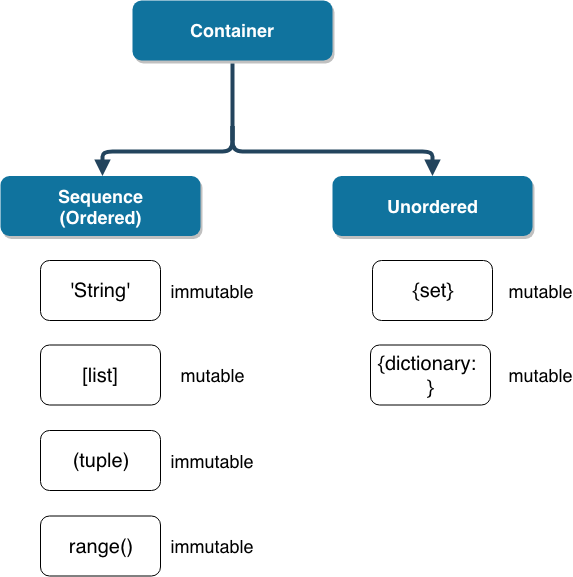

# 0808 파이썬 과목평가 준비

**오버플로우(overflow)**

- 데이터 타입 별로 사용할 수 있는 메모리의 크기가 제한되어 있다.
- 표현할 수 있는 수의 범위를 넘어가는 연산을 하게 되면, 기대했던 값이 출력되지 않는 현상, 즉 메모리가 차고 넘쳐 흐르는 현상
- **arbitrary-precision arithmetic**

```python
import sys
print(sys.float_info.epsilon)

abs(a - b) <= sys.float_info.epsilon

import math
math.isclose(a, b)
	
	
```

### complex

> 문자열을 변환할 때, 문자열은 중앙의 + 또는 - 연산자 주위에 공백을 포함해서는 안 됩니다.

```python
import datetime
now = datetime.datetime.now()
print(now)

f'올해는 {now:%Y} 이번달은 {now:%m}월 오늘은 {now:%d}일'
'올해는 2020 이번달은 07월 오늘은 20일'
```

### divmod

```python
a, b = divmod(5, 2)
print(a)
print(b)

앞에 몫 저장 뒤에 나머지저장
```

# 파이썬에서 돌아가면 다 문장이다.

- 문장안에 표현식이 있다.
  - 출력되면 표현식
  - 그래서 할당문은 표현식이 아니다.
  - 거의 모든 수학식은 표현식이다.

## 컨테이너(Container)



# 02

### 조건표현식

```python
true_value if <조건식> else false_value

print('0 보다 큼') if num > 0 else print('0 보다 크지않음')
```

# 04

## 이름 검색(resolution) 규칙

파이썬에서 사용되는 이름(식별자)들은 이름공간(namespace)에 저장되어 있습니다.

이것을, `LEGB Rule` 이라고 부르며, 아래와 같은 순서로 이름을 찾아나갑니다.

- `L`ocal scope: 정의된 함수

- `E`nclosed scope: 상위 함수

- `G`lobal scope: 함수 밖의 변수 혹은 import된 모듈

- `B`uilt-in scope: 파이썬안에 내장되어 있는 함수 또는 속성


1. `print()` 코드가 실행되면

1. 함수에서 실행된 코드가 아니기 때문에 `L`, `E` 를 건너 뛰고,

1. `print`라는 식별자를 Global scope에서 찾아서 `print = ssafy`를 가져오고,

1. 이는 함수가 아니라 변수이기 때문에 `not callable`하다라는 오류를 내뱉게 됩니다.

1. 우리가 원하는 `print()`은 Built-in scope에 있기 때문입니다.

# 06

## 문자열

- 변경할수 없고
- 순서가있고
- 순회가능함

### 값변경

`find(x)`

> 왼쪽부터 x의 첫번째위치 반환, 없으면 -1 반환

`.index(x)` 

> 왼쪽부터 x의 첫번쨰 위치 반환, 없으면, `오류발생`

`.replace(old, new[, count])` 

> 바꿀 대상 글자를 새로운 글자로 바꿔서 반환 

`.strip([chars])`

> 특정한 문자들을 지정하면, 양쪽을 제거하거나 왼쪽을 제거하거나 오른쪽을 제거함
>
> 지정하지 않으면 공백을 제거함

`separator.join(iterable)`

> 특정한 문자열로 만들어 반환합니다.
>
> 반복가능한(iterable) 컨테이너의 요소들을 separator를 구분자로 합쳐 (`join()`) 문자열로 반환

### 문자변형

- `.capitalize()` : 앞글자를 대문자로 만들어 반환한다.
- `.title()` : 어포스트로피나 공백 이후를 대문자로 만들어 반환한다.
- `.upper()` : 모두 대문자로 만들어 반환한다.

- `lower()` : 모두 소문자로 만들어 반환한다.
- `swapcase()` : 대 <-> 소문자로 변경하여 반환한다.

# 리스트

append는 리스트를 넣으면 리스트를 유지한채로 들어가고

extend는 리스트를 넣으면 리스트의 value값으로 빠져서 들어간다.

`.insert(i, x)` 

> 정해진 위치 i에 값을 추가한다.
>
> 리스트의 길이를 넘어서는 인덱스는 마지막에 아이템이 추가됩니다.

`.sort()` 

🎈🎈🎈내장함수 `sorted()`와는 다르게 원본list를 변형시키고 None을 리턴함

```python
print(lotto.sort())

하면 정렬된 리스트가아니라 None이 나옴!!!!!!!!!!!!!!!!!!!!!
```

# 09

# 객체(Object)

> Python에서 **모든 것은 객체(object)**이다.

> 모든 객체는 **타입(type), 속성(attribute), 조작법(method)**을 가진다.


## Object 중심의 장점


**<wikipedia - 객체지향 프로그래밍>**

> 객체 지향 프로그래밍은 프로그램을 유연하고 변경이 용이하게 만들기 때문에 대규모 소프트웨어 개발에 많이 사용된다.
>
> 또한 프로그래밍을 더 배우기 쉽게 하고 소프트웨어 개발과 보수를 간편하게 하며,
>
> 보다 직관적인 코드 분석을 가능하게 하는 장점을 갖고 있다.

- 코드의 **직관성**
- 활용의 **용이성**
- 변경의 **유연성**

# 10

# 인스턴스 & 클래스 메서드 (+스태틱 메서드)

### 인스턴스 메서드(instance method)

- 인스턴스가 사용할 메서드
- 클래스 내부에 정의되는 메서드의 기본값은 인스턴스 메서드f
- **호출시, 첫번째 인자로 인스턴스 자기자신 `self`이 전달됨**

### 클래스 메서드(class method)

- 클래스가 사용할 메서드
- `@classmethod` 데코레이터를 사용하여 정의
- **호출시, 첫 번째 인자로 클래스 `cls`가 전달됨**

### 스태틱 메서드(static method)

- 클래스가 사용할 메서드
- `@staticmethod` 데코레이터를 사용하여 정의
- **호출시, 어떠한 인자도 전달되지 않음**

### 상속의 이점

> 코드를 중복하여 정의하지 않을 수 있다.
>
> 공통된 속성이나 메서드를 부모 클래스에 정의하고 상속함으로써, 적은 코드로 다양한 형태의 객체를 만들 수 있다.

 진짜 상속관계인지 확인해봅시다. (클래스 상속 검사)

\#

issubclass(Student, Person)